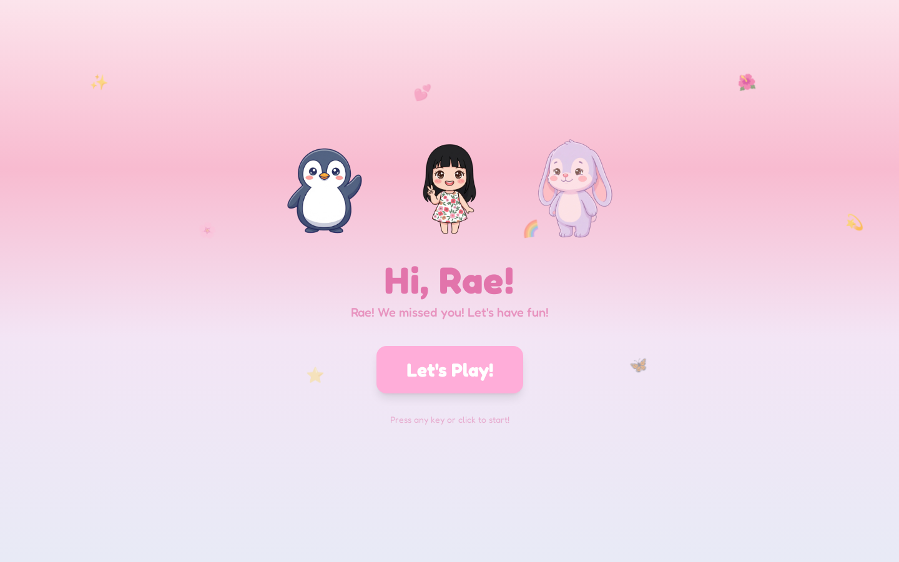

<div align="center">
  <h1>Rae's Learning Adventure 🐧🐰</h1>

  **A full-stack, AI-powered educational game designed for toddlers.**

  [](https://react.dev/)
  [](https://vitejs.dev/)
  [](https://trpc.io/)
  [](https://orm.drizzle.team/)
  [](https://tailwindcss.com/)
</div>

---

## 📖 Overview

**Rae's Learning Adventure** is a delightful, toddler-friendly web application designed to teach early literacy, math, and motor skills. Built with a soft pastel aesthetic and guided by animated companions (Penguin, Jelly Cat, and Rae), the game provides a safe, encouraging, and highly replayable educational environment.

Unlike static learning apps, this project uses a full-stack architecture with a **tRPC + Express backend** to generate dynamic, non-repetitive challenges via AI, ensuring the learning material scales gently as the child progresses.

## 📸 Screenshots

<div align="center">
  
  <p><em>The welcome screen — Penguin, Rae, and Jelly Cat greet the player on a warm pastel canvas. Press any key or tap to begin!</em></p>
</div>

---

## ✨ Key Features

- **Three Core Mini-Games:**
  - **Alphabet & Words:** Letter recognition and spelling, featuring family names, animals, body parts, and healthy foods.
  - **Math:** Arithmetic (addition and subtraction from 1–10) with visual "number block" representations.
  - **Motor Skills:** An arcade-style catching game with responsive keyboard (A/L) and mobile touch controls.
- **AI-Driven Challenges:** The backend uses an LLM integration to generate fresh, context-aware spelling and math problems on the fly, falling back to local dictionaries if offline.
- **Text-to-Speech (TTS):** Character-specific, server-generated voice-overs that read prompts aloud and offer warm encouragement ("Great job, Rae!").
- **Five Themed Worlds:** Explore 50 levels across environments like *Penguin's Garden* and *Cloud Kingdom*, each with unique background music and positive messaging (e.g., encouraging vegetable consumption).
- **Parent-Friendly Design:** Built-in screen-time reminders automatically suggest breaks after 20 minutes ("Penguin and Jelly Cat are getting sleepy...").
- **Cross-Platform Play:** Fully responsive design with large touch targets for tablets/phones and keyboard-only navigation for laptops.

## 🛠️ Tech Stack

This project is a modern TypeScript monorepo-style application:

- **Frontend:** React 19, Vite, Framer Motion (for smooth character animations), Tailwind CSS, Radix UI, and Wouter.
- **Backend:** Node.js, Express, tRPC (for end-to-end type safety), and Zod.
- **Database:** Drizzle ORM with MySQL (tracking user progress, level completions, and collected stars/hearts).
- **Audio:** Web Audio API for procedural background music and synthesized sound effects.

## 🚀 Getting Started

### Prerequisites

- Node.js 18+ and `pnpm` (recommended)
- A MySQL database
- Required API keys for LLM and TTS services (if using the AI features)

### Installation

1. **Clone the repository:**
   ```bash
   git clone https://github.com/limchinhan123/raes-learning-adventure.git
   cd raes-learning-adventure
   ```

2. **Install dependencies:**
   ```bash
   pnpm install
   ```

3. **Set up environment variables:**
   Ensure your `.env` file contains your database connection string and any necessary API keys.

4. **Initialize the database:**
   ```bash
   pnpm db:push
   ```

5. **Run the development server:**
   ```bash
   pnpm dev
   ```
   This will start both the Vite frontend and the Express backend concurrently.

### Building for Production

To build the project for production deployment:
```bash
pnpm build
pnpm start
```

## 🎮 Game Architecture & State

The client-side experience is orchestrated by a robust `GameContext`, which manages the player's journey through the app:
- **Flow:** `Welcome` → `World Map` → `Level Select` → `Game Screen` → `Reward Screen`.
- **Persistence:** Game progress (stars, hearts, unlocked worlds) is synced to the database via tRPC and cached locally.
- **Audio Engine:** Procedural background music adapts its tempo and intensity based on the current screen state, ensuring a calming atmosphere.

## 🤝 Contributing

Contributions, bug reports, and feature requests are welcome! If you're adding new game modes or word categories, please check `shared/gameConfig.ts` to ensure alignment with the existing difficulty scaling and world themes.

## 📄 License

This project is licensed under the MIT License. See the `package.json` for details.

---
*Built with ❤️ for early childhood learning.*
